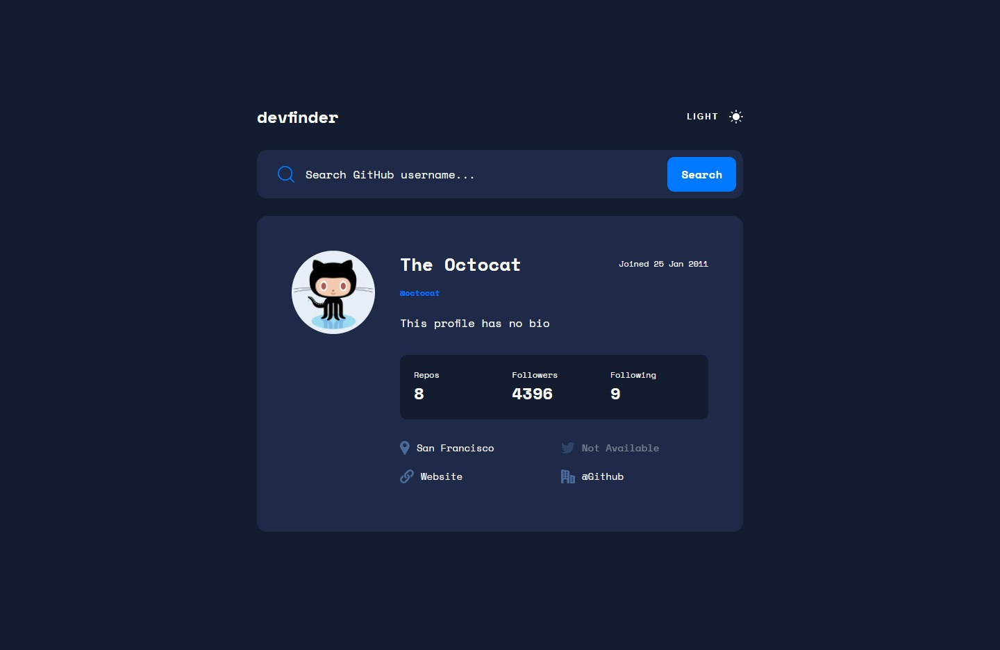

# Frontend Mentor - GitHub user search app

This is a solution to the GitHub user search app challenge on Frontend Mentor. Frontend Mentor challenges help you improve your coding skills by building realistic projects.

## Table of contents

- [Overview](#overview)
  - [The challenge](#the-challenge)
  - [Screenshot](#screenshot)
  - [Links](#links)
- [My process](#my-process)
  - [Built with](#built-with)
  - [What I learned](#what-i-learned)
  - [Continued development](#continued-development)
  - [Useful resources](#useful-resources)
- [Author](#author)
- [Acknowledgments](#acknowledgments)

## Overview

### The challenge

Users should be able to:

- View the optimal layout for the app depending on their device's screen size
- See hover states for all interactive elements on the page
- Search for GitHub users by their username
- See relevant user information based on their search
- Switch between light and dark themes

### Screenshot

### Links

- [GitHub](https://github.com/jarekTerejko/github-user-search)
- [Live Site URL](https://github-user-search-terejko.netlify.app)

## My process

### Built with

- Semantic HTML5 markup
- CSS custom properties
- CSS Grid
- [React](https://reactjs.org/) - JS library
- [Styled Components](https://styled-components.com/) - For styles
- [Framer Motion](https://www.framer.com/motion/) - For animations

### What I learned

- React
- Styled Components
- Framer Motion

### Useful resources

- The Net Ninja Framer Motion (for React) Tutorial [YouTube](https://www.youtube.com/playlist?list=PL4cUxeGkcC9iHDnQfTHEVVceOEBsOf07i)
- The Net Ninja Full Modern React Tutorial [YouTube](https://www.youtube.com/playlist?list=PL4cUxeGkcC9gZD-Tvwfod2gaISzfRiP9d)

## Author

- Website - [Jarosław Terejko](https://terejkodev.netlify.app)
- Frontend Mentor - [@jarekTerejko](https://www.frontendmentor.io/profile/jarekTerejko)

## Acknowledgments

- Thank you to the [Frontendmentor](https://www.frontendmentor.io/home) for provading this project.
